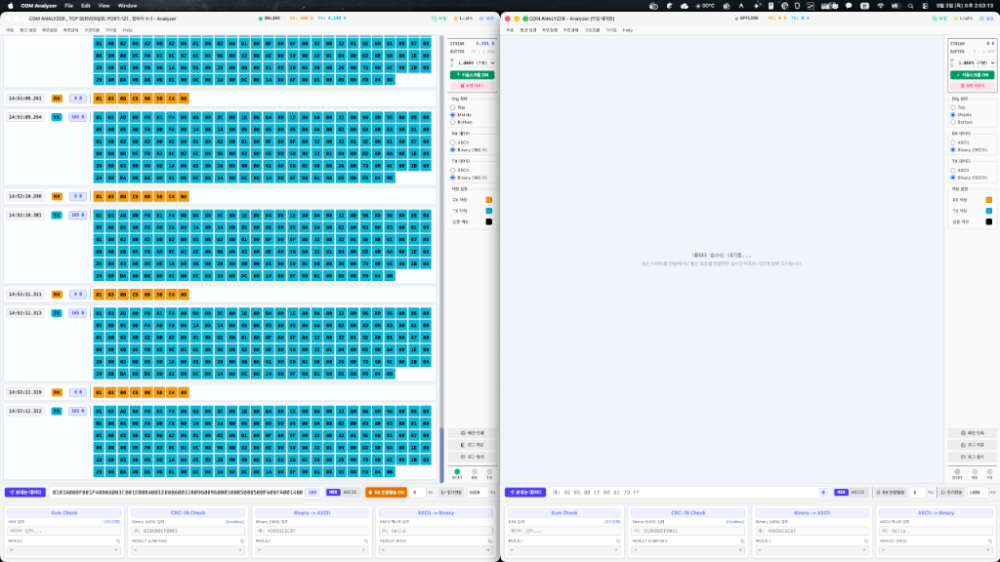
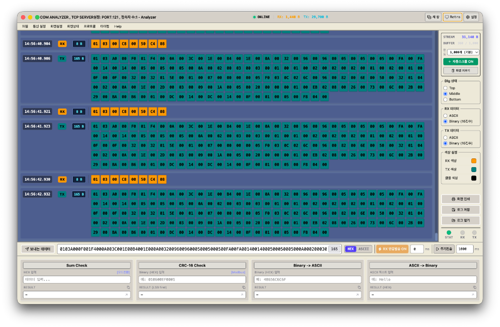
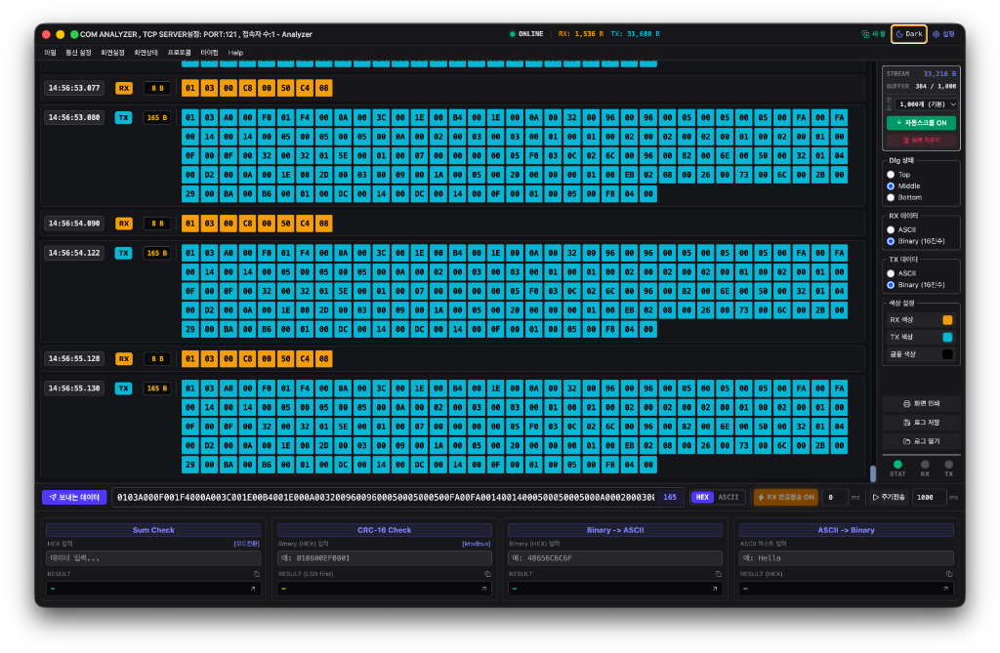
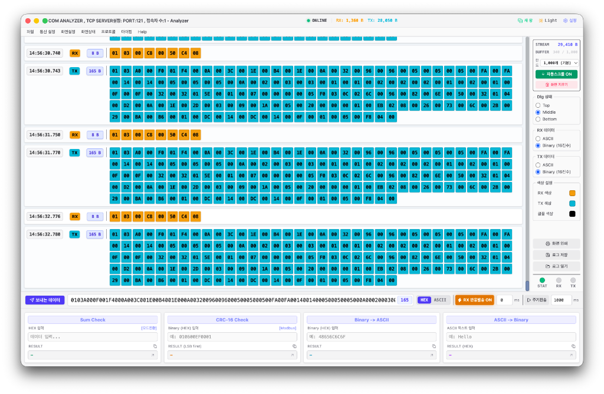

# ⚡️ Open COM Analyzer

<div align="center">


**Cross-Platform Serial (RS-232/485) & TCP Packet Analyzer**  
*시리얼(Serial / COM) 및 TCP 통신 패킷을 실시간 바이트 격자로 분석하고 송수신하는 크로스플랫폼 도구*

[📥 최신 릴리즈 다운로드 (Releases)](https://github.com/rlatjd1f/open-com-analyzer/releases)

</div>

---

## 📸 미리보기 (Screenshots)

### 1. 다중 윈도우 동시 실행 (Multi-Window)
> `Cmd + N` (Windows: `Ctrl + N`) 또는 상단 **`[새 창]`** 버튼으로 독립된 창을 여러 개 열어 **Master ↔ Slave 실시간 통신 대조 테스트**를 수행할 수 있습니다.



---

### 2. 클래식 레트로 테마 (Classic Retro Theme)
> 개행 단위 패킷 스트림, `HH:mm:ss.SSS` 타임스탬프, 바이트 수 뱃지, RX 반응발송 및 4종 계산기를 한 화면에서 제어할 수 있습니다.



---

### 3. 모던 다크 테마 (Modern Dark Theme)
> 야간 및 장시간 분석 시 눈의 피로도를 낮추는 고대비 다크 테마입니다.



---

### 4. 모던 라이트 테마 (Modern Light Theme)
> 밝고 선명한 화이트/그레이 톤의 모던 라이트 테마입니다.



---

## ✨ 주요 기능 (Key Features)

### 1. 개행 단위 패킷 스트림 & 수직 정렬
- **정밀 타임스탬프**: 각 패킷 행 좌측에 `HH:mm:ss.SSS` 시간, `[RX]`/`[TX]` 방향 뱃지, 바이트 수(`8 B`, `165 B`) 표시
- **수직 정렬 바이트 그리드**: 좌측 메타데이터 폭을 고정하여 패킷 길이에 관계없이 첫 번째 바이트 셀이 일정하게 정렬
- **1:1 바이트 셀**: 16진수 및 ASCII 문자를 1:1 정사각형 셀로 표시
- **호버 인스펙터**: 바이트 셀 위에 마우스를 올리면 HEX, DEC, ASCII, 패킷 내 바이트 위치(`#1`) 툴팁 표시

### 2. 다중 통신 인터페이스 지원
- **Serial Port (COM)**: USB-to-UART, FTDI, CP210x, CH340 등 시리얼 포트 자동 감지 및 설정 (9,600 ~ 921,600 bps, Data Bits, Parity, Stop Bits)
- **TCP Server 모드**: 기본 Port: 121로 소켓 서버를 열어 클라이언트 접속 및 패킷 모니터링
- **TCP Client 모드**: 원격 TCP 서버 IP/Port로 직접 접속하여 송수신 테스트
- **가상 장치 시뮬레이터 (Virtual Device)**: 하드웨어 장비 없이도 테스트 가능한 Modbus RTU Slave 에코 및 센서 스트리밍 시뮬레이터 내장

### 3. 4종 내장 계산 및 변환 도구 (Utility Panel)
1. **Sum Check**: 8-bit 및 16-bit 체크섬 연산
2. **CRC-16 Check**: Modbus RTU CRC (LSB first) 및 CCITT CRC-16 연산
3. **Binary → ASCII**: 16진수 바이트를 텍스트 문자열로 변환
4. **ASCII → Binary**: 텍스트 문자열을 16진수 HEX 바이트열로 변환
- "보내는데이터 적용" 및 결과 클립보드 복사 지원

### 4. 자동 송신 모드
- **`RX 반응발송` (1:1 반응형 자동 응답)**: RX 패킷 수신 시 설정된 송신 데이터를 1회씩 자동 응답 전송 (응답 지연 시간 ms 조절 가능)
- **`주기전송` (반복 전송)**: 설정한 주기(ms)마다 데이터를 반복 자동 발송

### 5. 성능 최적화 & 버퍼 관리
- **`React.memo` & CSS Variables**: 신규 패킷 수신 시 기존 패킷 리렌더링을 차단하고, 테마 변경 시 즉시 색상 전환
- **레이아웃 격리**: 창 크기 변경 시에도 프레임 드랍 없이 부드러운 반응성 유지
- **FIFO 링 버퍼**: 메모리 관리 및 스크롤 성능 유지를 위한 패킷 한도 설정 (기본 1,000줄 / 500, 1000, 2000, 5000, 무제한 선택 가능)
- **버퍼 상태 표시 및 화면 지우기 (`Cmd + K`)**

---

## ⌨️ 단축키 (Keyboard Shortcuts)

| 단축키 (macOS) | 단축키 (Windows) | 기능 |
| :--- | :--- | :--- |
| **`Cmd + N`** | **`Ctrl + N`** | **새 창 열기 (독립된 세션의 새 창 생성)** |
| **`Cmd + ,`** | **`Ctrl + ,`** | **환경설정 열기 / 닫기 (시리얼, TCP, 가상장치, 버퍼설정)** |
| **`Cmd + K`** | **`Ctrl + K`** | **화면 버퍼 초기화 (Clear Screen)** |
| **`Space`** | **`Space`** | **화면 일시정지 / 실시간 수신 재개 (Freeze / Resume)** |

---

## 🛠 기술 스택 (Tech Stack)

- **Desktop Runtime**: Electron 44
- **Frontend**: React 19, TypeScript, Tailwind CSS, Vite, Lucide Icons
- **Communication Engine**: Node.js `serialport`, `net`, `ws`

---

## 🚀 개발 및 빌드 (Getting Started)

### 1. 설치
```bash
git clone https://github.com/rlatjd1f/open-com-analyzer.git
cd open-com-analyzer
npm install
```

### 2. 개발 실행
```bash
# Vite 웹 프론트엔드 + 백엔드 서버 동시 실행
npm run dev

# Electron 데스크톱 앱 실행
npm run desktop
```

### 3. 빌드 및 패키징
```bash
# TypeScript 검사 및 Vite 빌드
npm run build

# macOS 패키징 (.app)
npm run package:mac

# Windows 패키징 (x64)
npm run package:win

# macOS /Applications 직접 설치
npm run install:app
```

---

## 📄 라이선스 (License)

This project is licensed under the **MIT License**.
자유롭게 사용, 수정, 배포하실 수 있습니다.
